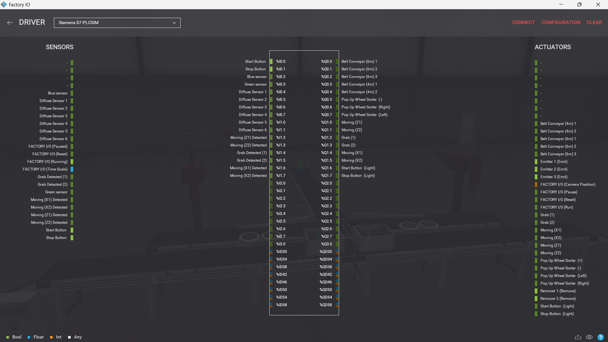
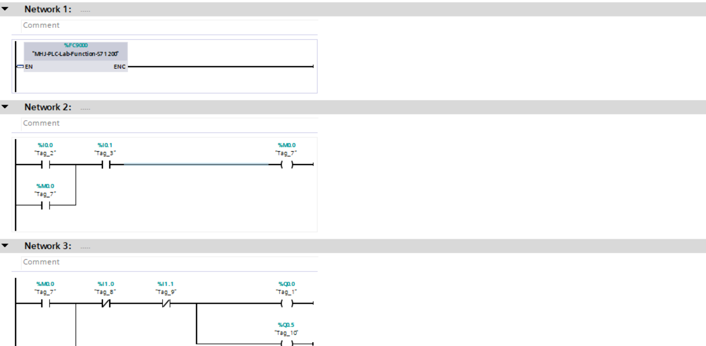
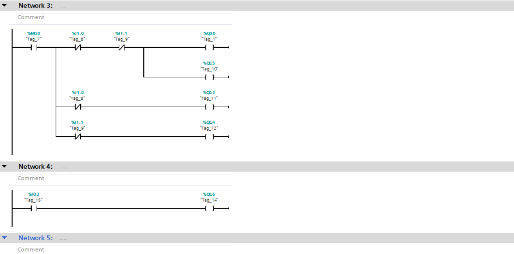
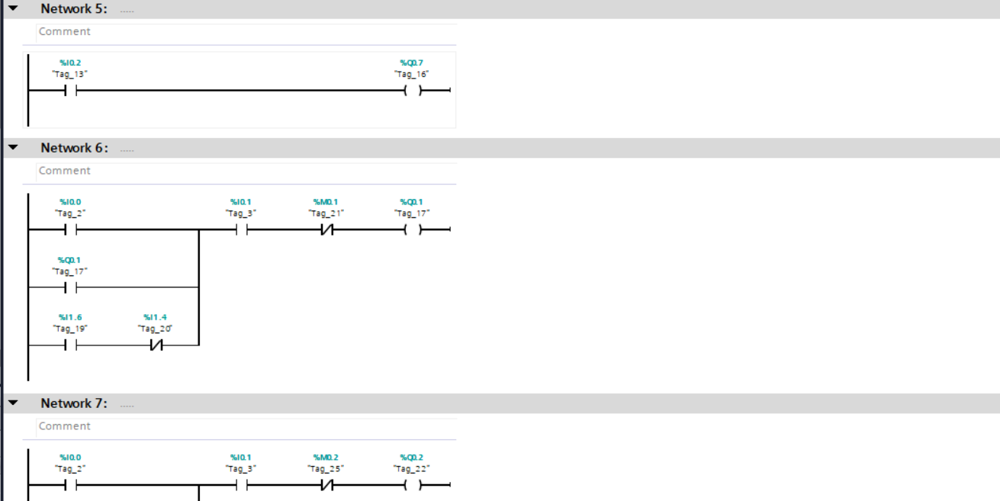
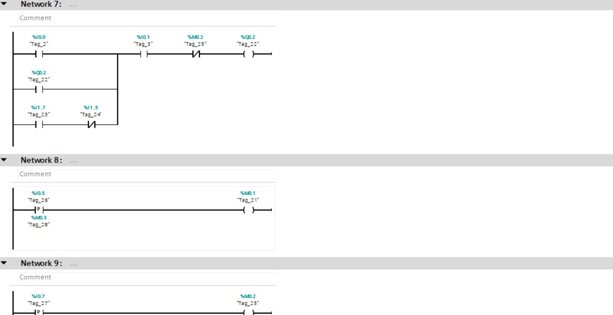
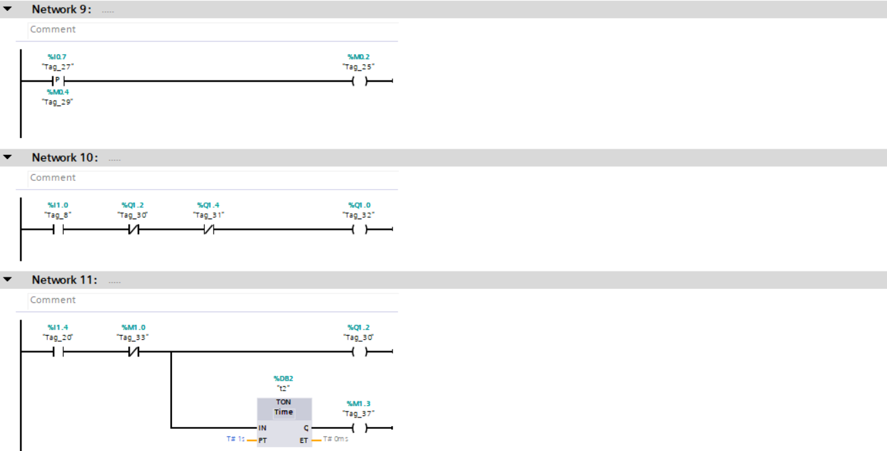
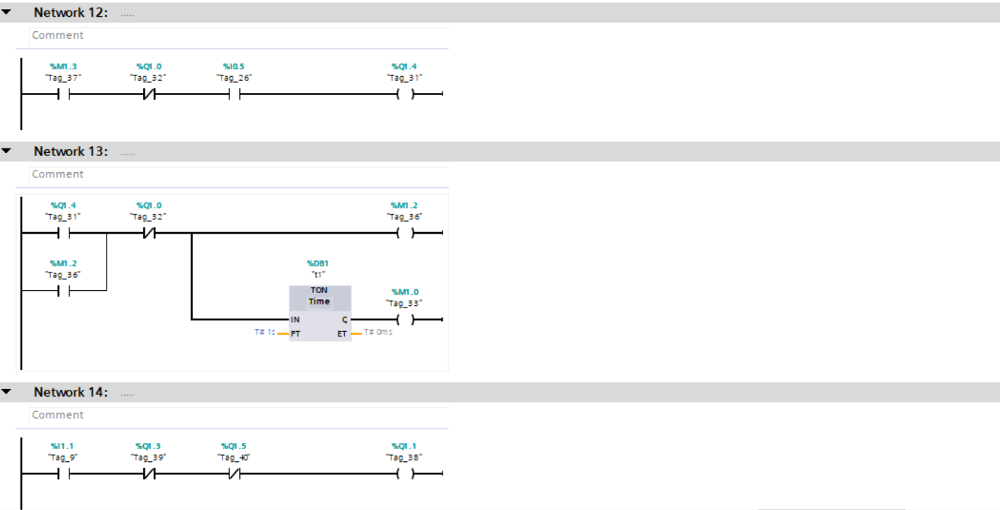
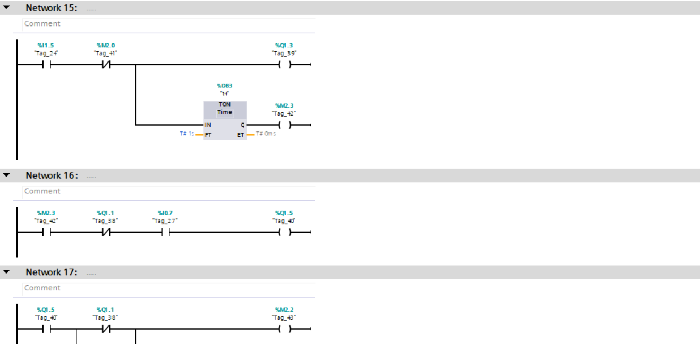
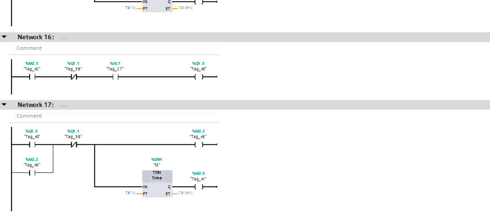
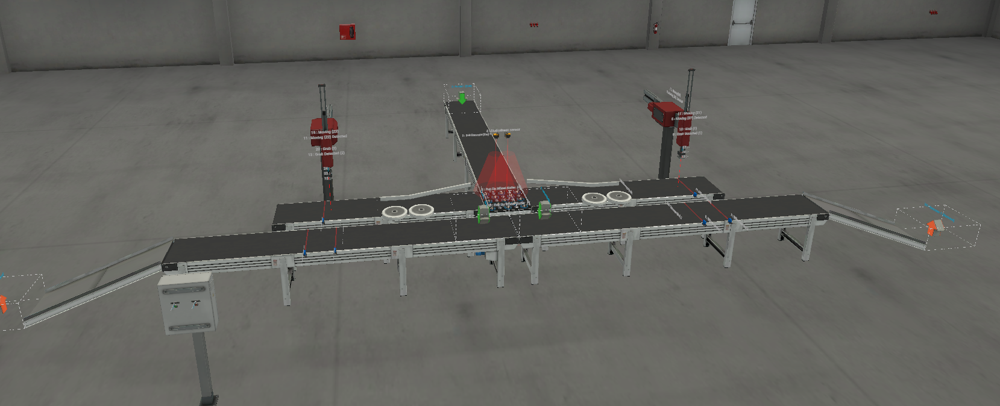

# Automated-Multi-Robot-Sorting-and-Packaging-System

##  Project Overview
This project demonstrates an advanced industrial automation cell for **color-based sorting and precision batching**.

The system integrates a high-speed **Pop-up Wheel Sorter** with dual **Two-Axis Pick & Place robots**, enabling real-time classification and distribution of products into dedicated batching zones.

Developed using **Siemens TIA Portal** and simulated in **Factory I/O**.

---

##  Technology Stack
- **PLC Programming:** Siemens TIA Portal (S7-1200)  
- **Simulation:** Factory I/O (Custom Scene)  
- **Robotics:** Dual Two-Axis Pick & Place with Vacuum Grippers  
- **Sensors:** Vision Sensors + Diffuse Photoelectric Sensors  
- **Communication:** Siemens S7-PLCSIM  

---

##  System Workflow

1. **Color Detection**
   - Vision sensors identify product color (Blue / Green) at entry point  

2. **Dynamic Sorting (Pop-up Wheel)**
   - High-speed Pop-up Wheel Sorter directs items based on color:
     - Left path
     - Right path

3. **Parallel Robotic Handling**
   - Two independent robotic stations operate simultaneously:
     - **Robot 1:** Handles first color stream  
     - **Robot 2:** Handles second color stream  

4. **Pick & Place Operation**
   - Vacuum grippers pick items after confirmation signals  
   - Robots place items into assigned batching zones  

5. **System Synchronization**
   - Conveyors and robots are interlocked to ensure safe operation  
   - Movement only allowed when robots are in safe states  

---

##  Technical Highlights

- **Multi-Robot Coordination**
  - Parallel execution of two robotic cells within one PLC system  

- **Advanced Sorting Mechanism**
  - Pop-up Wheel Sorter enables fast directional switching  

- **State-Based Control Logic**
  - Full sequential logic using PLC memory bits (M-tags)  

- **Feedback Control System**
  - Motion verification using sensor feedback (Detect / Grab / Home signals)  

- **Industrial Safety Interlocking**
  - Global stop system halts all actuators instantly  

---

##  Project Preview

###  System Configuration

###  Control Logic (Ladder Diagram)
  

  

  

  

###  Factory I/O Simulation

---

##  Demo Video
 [Watch full system demonstration](video.mp4)

---

##  How to Run
1. Open project in **TIA Portal**  
2. Start **S7-PLCSIM**  
3. Load Factory I/O scene  
4. Connect using PLC driver  
5. Switch PLC to RUN mode  
6. Start system from control panel  

